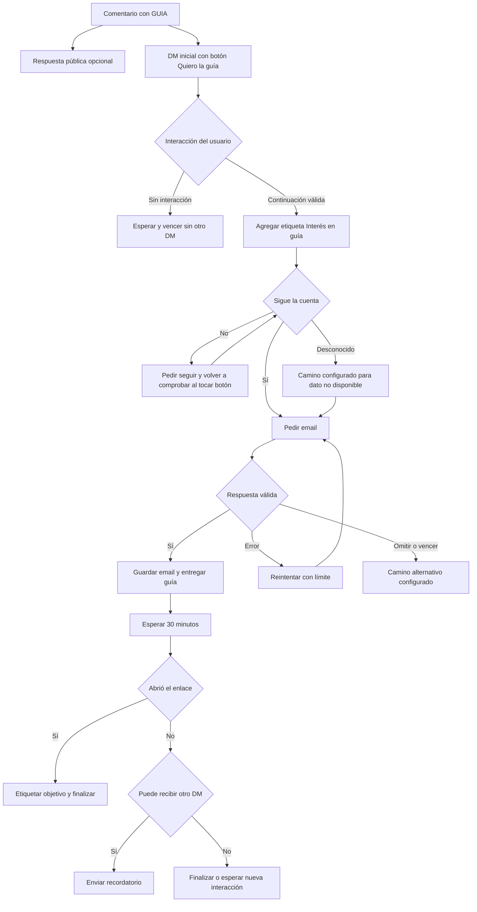

# Plan de OpenReply para automatizaciones de comentarios de Reels

Fecha de revisión: 1 de octubre de 2026.

El objetivo es que OpenReply permita construir y administrar conversaciones completas que empiezan cuando alguien comenta un Reel de Instagram: varios mensajes, botones, preguntas, etiquetas, condiciones, acciones y atención humana. La experiencia de referencia es Manychat. Este documento propone el alcance, la arquitectura, el orden de desarrollo y los criterios para verificar cada entrega.

Es viable aprovechar la infraestructura actual. La principal ampliación consiste en pasar de una campaña con pasos fijos a un flujo reutilizable con versiones y una ejecución persistente por contacto. Felipe programa desde la aplicación de Instagram y confirmó que la opción próximo Reel cubre su necesidad, porque no suele programar varios videos. Esa será la forma de preparar una automatización antes de publicar.

El núcleo del plan ya está implementado en el proyecto. La conexión real con Instagram en producción aún necesita una prueba de envío; la verificación local usa proveedores simulados y una base aislada. El plan conserva las ampliaciones futuras y sus criterios de cierre. La guía de uso está en [Flujos de Reels](flujos.md).

## Implementación aplicada

- Editor visual con bloques conectables, borradores, publicación, versiones, importación, exportación, plantillas y simulador.
- Mensajes de texto, botones y respuestas rápidas después de la apertura; imágenes, video, audio y PDF. Meta directo entrega el PDF por enlace; Zernio admite el adjunto.
- Preguntas consecutivas para email, teléfono, texto, números y opciones; validación, reintentos, omisión y vencimiento.
- Etiquetas, campos, condiciones, esperas, objetivos, variantes por porcentaje, integraciones y derivación a otro flujo.
- Pausa por contacto, responsable, notas internas y derivación para atención humana.
- Próximo Reel con fecha de armado, asignación única y recuperación de los comentarios iniciales.
- Ejecuciones persistentes, prevención de efectos repetidos, registro por paso y medición de enlaces incorporada a las métricas existentes.

Las tarjetas, galerías, contenido dinámico, IA, carpetas, horarios completos y reglas iniciadas por cambios internos siguen siendo ampliaciones del plan. La interfaz muestra formatos compatibles con la conexión elegida. Esta entrega no establece equivalencia total con Manychat.

## La base que ya existe

La revisión inicial del repositorio encontró las siguientes capacidades, antes de aplicar el editor visual:

| Área | Estado actual | Ampliación propuesta |
| --- | --- | --- |
| Destino | Publicación específica, cualquier publicación y próximo Reel | Próximo Reel más fiable, estado visible y varios Reels publicados por regla |
| Comentarios | Palabras clave, palabra completa, coincidencia parcial y cualquier comentario | Exclusiones, prioridades, horarios y control de repetición |
| Respuesta pública | Mensaje con variaciones | Historial independiente, criterios de selección y edición más clara |
| Mensajes privados | Apertura, entrega de enlaces y un seguimiento | Cantidad variable de pasos, ramas y mensajes reutilizables |
| Botones | Continuación y hasta dos enlaces medidos | Varios destinos y respuestas rápidas según capacidades del proveedor |
| Seguimiento de cuenta | Pedido y verificación cuando hay información | Condición reutilizable con estados sí, no y desconocido |
| Captura | Una pregunta de email, teléfono o texto por campaña | Varias preguntas, tipos de campo, validación y caminos alternativos |
| Contactos | Etiquetas, campos, exportación y sincronización | Segmentos, historial del flujo y acciones durante cualquier paso |
| Inbox | Lectura y respuesta manual | Asignación, notas, pausa automática y derivación desde el flujo |
| Medición | Envíos, errores, enlaces y reportes | Embudo por paso, abandono y atribución por contacto y ejecución |
| Administración | Plantillas, duplicación, cuentas, espacios y roles | Carpetas, versiones, importación y biblioteca de flujos |

El punto de partida era un formulario con vista previa y columnas para cada opción en `Automation`. La aplicación ya contaba con Next.js, PostgreSQL, Prisma, Redis y un worker permanente con BullMQ. La implementación nueva agrega el grafo, sus versiones y el registro general por paso sobre esa infraestructura.

## Preparar una automatización para el próximo Reel

El recorrido elegido por Felipe es preparar y activar el flujo en OpenReply, seleccionar próximo Reel y dejar el video programado desde Instagram. Cuando aparezca el primer Reel nuevo, OpenReply vincula automáticamente la campaña a su ID y comienza a procesar los comentarios elegibles. El criterio es el orden real de publicación después de activar la espera; se aplica tanto a un Reel programado como a uno publicado manualmente.

La opción próximo Reel ya existe. La primera entrega mejora su fiabilidad y muestra claramente los estados «esperando publicación», «vinculado» y «cancelado». Después de vincularse, la campaña conserva ese Reel y no salta al siguiente contenido.

Las mejoras necesarias son guardar la hora en que se arma la espera, evitar que rearmar una campaña antigua elija un Reel anterior, hacer explícito qué sucede con varias campañas pendientes y ampliar la búsqueda cuando sea necesario. Una foto, un carrusel o una Story no deben consumir la espera de próximo Reel. Hoy el vínculo se revisa aproximadamente cada cinco minutos; un comentario anterior al vínculo puede depender de la recuperación posterior.

La recepción de un comentario debe intentar resolver el destino pendiente y, cuando corresponda, guardar ese comentario para procesarlo después de la vinculación. Debe haber recuperación de comentarios iniciales, deduplicación y un plazo de vencimiento visible. No podemos prometer respuesta instantánea antes de identificar el contenido.

La gestión de varios Reels futuros específicos queda como ampliación opcional para una necesidad posterior. El alcance elegido permite a Felipe preparar su automatización con la opción próximo Reel que ya conoce.

## La regla que define la conversación

El comentario permite enviar una respuesta privada inicial. Esa respuesta, por sí sola, no abre la conversación para seguir enviando mensajes. Manychat documenta que una respuesta del usuario, un botón de continuación o una respuesta rápida abre la ventana de 24 horas; abrir una web mediante un botón no lo hace. También limita su primer mensaje privado a un bloque de contenido. Véase [Comments trigger](https://help.manychat.com/hc/en-us/articles/14281316989724-Instagram-Post-and-Reel-Comments-trigger).

El diseño debe representar esa diferencia: comentario recibido, respuesta privada inicial, espera de interacción y conversación habilitada. Leer el DM tampoco debe considerarse una respuesta. Antes de cada envío y después de cualquier demora, el motor vuelve a comprobar si puede enviar ese mensaje.

Meta documenta una respuesta privada inicial por comentario, enviada dentro de los siete días desde su creación. El motor debe guardar la fecha original y evitar que una recuperación o demora envíe fuera de ese plazo. Referencia: [documentación de private replies en el repositorio oficial de Meta](https://github.com/fbsamples/messenger-platform-samples/commit/1ef12f9).

La ventana habilitada por Instagram no constituye consentimiento para campañas por email ni permiso indefinido para enviar DMs. Los datos y el permiso para otro canal se registran por separado.

## Las funciones que vamos a construir

### Disparadores y asignación

- Reglas para un Reel publicado, un conjunto de Reels publicados, todos los Reels y próximo Reel.
- Palabras incluidas y excluidas, coincidencia exacta o parcial y cualquier comentario.
- Prioridad visible cuando dos reglas coinciden; elección determinista de la respuesta privada inicial.
- Exclusión por etiqueta, pausa del contacto, baja o recurso ya entregado.
- Política de repetición por contacto y Reel, con límites del proveedor aplicados.
- Fecha de inicio, fecha de fin, horarios y zona horaria.
- Respuesta pública opcional con variantes y resultado separado del DM.

Manychat ofrece destinos específico, todos y próximo, palabras excluidas y variantes públicas. Esa referencia está documentada en [Comments trigger](https://help.manychat.com/hc/en-us/articles/14281316989724-Instagram-Post-and-Reel-Comments-trigger). Las prioridades y la política de repetición anteriores son decisiones propuestas para OpenReply.

### Mensajes y elecciones

- Texto con variables, valores alternativos si falta un dato y vista previa.
- Mensaje inicial de texto que solicita una respuesta escrita. Las conexiones actuales usan esa apertura para evitar que un botón inicial incompatible consuma la única respuesta privada disponible. Los botones aparecen en los pasos posteriores.
- Varios mensajes después de una interacción habilitante.
- Botones para continuar, elegir una rama o abrir un enlace.
- Respuestas rápidas con tratamiento de respuesta inesperada.
- Imágenes y otros formatos compatibles, incorporados por proveedor después de verificar la API.
- Enlaces con medición individual y parámetros de campaña.

La referencia de formatos se encuentra en [Content Block types](https://help.manychat.com/hc/en-us/articles/14281196200604-Content-Block-types), y la de elecciones en [Buttons](https://help.manychat.com/hc/en-us/articles/14281157003292-Buttons) y [Quick Reply Buttons](https://help.manychat.com/hc/en-us/articles/14281157129116-Quick-Reply-Buttons). Que Manychat ofrezca un formato no confirma su disponibilidad en nuestra conexión: el editor debe mostrar las capacidades verificadas de Meta directo y Zernio.

### Datos y segmentación

- Pedir varias respuestas en una conversación y guardarlas en campos separados.
- Email, teléfono, texto, número y opciones; fechas cuando se defina y valide su formato.
- Mensaje de error, máximo de intentos, omitir y plazo sin respuesta.
- Ramas por respuesta válida, inválida, omitida y vencida.
- Agregar y quitar etiquetas en cualquier punto.
- Asignar, limpiar e incrementar campos compatibles.
- Condiciones con grupos «todas» o «alguna», comparaciones y estados vacíos.
- Condición de seguimiento con camino explícito cuando el proveedor no devuelve información.
- Segmentos guardados por origen, etiquetas, campos y actividad.

Las referencias son [Data Collection Block](https://help.manychat.com/hc/en-us/articles/18362925739932-Data-Collection-Block), [Custom User Fields](https://help.manychat.com/hc/en-us/articles/14281167138588-Custom-User-Fields-and-Bot-Fields), [Condition Block](https://help.manychat.com/hc/en-us/articles/14281142518556-Condition-Block) y [System Fields](https://help.manychat.com/hc/en-us/articles/14281292522652-System-Fields).

### Acciones y esperas

- Demora por duración, fecha o campo de fecha, con horarios de continuación.
- Seguimiento condicionado a no haber hecho clic, contestado o completado un objetivo.
- Cancelación de la espera si ocurre el evento esperado.
- Envío de datos a Google Sheets, un CRM o un webhook.
- Llamada HTTP configurable con autenticación protegida, tiempo máximo y ramas de éxito o error.
- Iniciar un flujo reutilizable y regresar al paso correspondiente si se configura como subflujo.
- Marcar un objetivo, detener una ejecución o pausar automatizaciones del contacto.
- Distribuir contactos entre variantes para pruebas A/B.

Manychat documenta acciones, demoras y distribución en [Actions](https://help.manychat.com/hc/en-us/articles/17636378650268-Actions), [Smart Delay](https://help.manychat.com/hc/en-us/articles/14281197046812-Smart-Delay) y [Randomizer](https://help.manychat.com/hc/en-us/articles/14281151100060-Randomizer). En OpenReply, una espera vencida no debe provocar un envío fuera de la ventana; el flujo debe terminar o quedar esperando una interacción válida, según la configuración.

### Atención humana y administración

- Derivar desde una rama a la bandeja de entrada.
- Asignar responsable, agregar nota y marcar conversación abierta o resuelta.
- Pausar automatizaciones cuando una persona toma la conversación.
- Reanudar con una acción explícita y una política definida para las esperas.
- Borradores, publicación, historial de versiones y restauración como versión nueva.
- Carpetas, búsqueda, duplicación, importación y exportación del flujo.
- Plantillas con variables para recurso, curso, precio, captación y calificación.

Las referencias son [Manychat Inbox](https://help.manychat.com/hc/en-us/articles/14281070478748-Manychat-Inbox), [Pause all automations](https://help.manychat.com/hc/en-us/articles/19957883687708-How-to-pause-all-automations) y [Automation tab](https://help.manychat.com/hc/en-us/articles/14281111044124-Automation-tab-Overview).

La extensión `HUMAN_AGENT` sólo se habilitará si el proveedor la soporta y el permiso está aprobado: permite atención humana hasta siete días y no autoriza mensajes automáticos. Referencia: [colección vigente del repositorio oficial de Meta](https://raw.githubusercontent.com/fbsamples/messenger-platform-samples/main/postman/instagram-platform-api.postman_collection.json).

### Editor y medición

Habrá dos formas de editar el mismo flujo: un asistente rápido para las campañas habituales y un editor visual para conversaciones con ramas. El editor visual tendrá nodos conectados, configuración lateral, vista previa de teléfono, zoom, búsqueda de pasos, duplicación, deshacer y rehacer. Publicar debe validar que todos los caminos tienen una salida y que los mensajes respetan las capacidades de la conexión.

El simulador recorrerá respuestas, etiquetas, condiciones y demoras con datos de prueba. Las acciones externas usarán resultados simulados; una prueba real en Instagram se distinguirá de la simulación. Referencias: [Build an automation](https://help.manychat.com/hc/en-us/articles/14281166306332-How-to-build-a-Manychat-automation) y [Preview automations](https://help.manychat.com/hc/en-us/articles/14281198254620-How-to-preview-automations-in-Manychat).

La medición propuesta incluye comentarios elegibles, respuesta inicial aceptada, interacción habilitante, avance por paso, enlaces abiertos, datos capturados, objetivos, abandono y errores. Cada porcentaje tendrá un denominador visible. Una respuesta aceptada por la API no se mostrará como entregada o leída sin un evento que lo confirme. Un clic o una etiqueta tampoco equivalen a una venta; las ventas requieren un evento de conversión verificable.

## Cómo funcionaría un flujo completo

Ejemplo propuesto para un Reel que ofrece una guía:

La verificación de seguimiento, los reintentos y las esperas tendrán límites para que el contacto no quede atrapado en un ciclo. Este ejemplo es una propuesta de experiencia; no representa un flujo ya implementado.

## Arquitectura propuesta

Separaremos la regla que dispara, el flujo que se ejecuta y el Reel al que se aplica. Así una misma conversación puede reutilizarse en varios Reels sin duplicar toda su configuración.

| Componente | Responsabilidad |
| --- | --- |
| Automation o Campaign | Nombre, cuenta, objetivo y asociación a una versión de flujo |
| TriggerRule | Palabras, exclusiones, prioridades y política de repetición |
| ReelBinding | Publicación existente o espera de próximo Reel, hora de armado, referencia de medios existentes, estado e ID final |
| Flow y FlowVersion | Identidad del flujo, borrador editable y definición publicada inmutable |
| FlowRun | Contacto, cuenta, versión, comentario de origen y estado de una conversación |
| StepRun | Estado, intentos, entradas, salidas y resultado de un paso |
| ContactWait | Evento esperado, ejecución correspondiente, correlación y vencimiento |
| EventInbox y Outbox | Recepción deduplicada de eventos y entrega recuperable del trabajo al worker |
| Delivery o Effect | Reserva duradera de cada envío o acción, incluidos resultados inciertos |
| ProviderCapabilities | Formatos, límites y permisos realmente disponibles por proveedor |
| FlowEvent y GoalEvent | Evidencia de avance, clics y objetivos |

La definición de nodos y conexiones puede guardarse como JSON validado dentro de `FlowVersion`; las ejecuciones y entregas tendrán registros consultables en la base de datos. La versión tendrá su propio número de esquema para poder migrar definiciones en el futuro.

Cada ejecución quedará ligada a la versión con la que empezó. Los botones identificarán ejecución, paso y versión; editar o publicar otro flujo no modificará conversaciones ya iniciadas. Se guardará el contexto del Reel y la regla que originó el contacto.

El worker serializará cambios por cuenta y contacto, resolverá respuestas contra la espera correcta y registrará cada efecto antes de enviarlo. Un timeout de envío se considerará resultado incierto hasta que haya evidencia adicional; no se repetirá automáticamente como si nada se hubiese enviado. Esta política aprovecha la protección que ya existe para algunas entregas Zernio y la generaliza.

Los clics necesitan contexto de contacto, ejecución, paso y enlace para soportar condiciones como «no abrió el recurso». La atribución propuesta identifica el uso de un enlace destinado a un contacto; no prueba quién lo abrió si fue compartido. Debe separar visitantes automáticos cuando haya evidencia suficiente.

Las acciones HTTP deberán limitar destinos, duración y tamaño, proteger credenciales y evitar acceso a redes internas. Estos controles son parte de construir un nodo de integración usable en una aplicación con varios espacios de trabajo.

## Problemas actuales que deben resolverse primero

1. El próximo Reel se busca desde la creación de la campaña. Debe buscarse desde la hora en que se activa esa espera y conservar una referencia de publicaciones ya existentes.
2. Un comentario puede llegar antes de que se vincule el Reel. Debe conservarse y recuperarse sin depender únicamente del barrido posterior.
3. Los postbacks y seguimientos leen la campaña actual. Necesitan una versión fija para no cambiar una conversación iniciada.
4. Hay una continuación diferida tras leer la apertura. Debe retirarse o condicionarse a una interacción que realmente habilite mensajes.
5. Los seguimientos requieren comprobación previa de la ventana, registro de resultado y tratamiento uniforme de límites y reintentos.
6. La protección contra envíos duplicados debe abarcar todos los proveedores, comentarios coincidentes y cada paso.
7. Dos campañas pueden competir por la misma respuesta o pregunta. Debe haber prioridad, correlación y una política visible de conversación activa.
8. Las capacidades difieren por proveedor; actualmente algunas respuestas rápidas se convierten en texto en Zernio. El editor debe reflejar esa diferencia.

Estos hallazgos provienen de lectura del código. La revisión no demuestra que todos hayan causado fallos en la cuenta de Felipe.

## Entregas y orden de desarrollo

| Etapa | Prioridad | Resultado usable | Dependencia |
| --- | --- | --- | --- |
| 0 | P0 | Contrato de flujos, reglas de envío y correcciones de continuidad | Revisión actual |
| 1 | P0 | Próximo Reel fiable, estado visible y recuperación de primeros comentarios | Etapa 0 para envíos y eventos |
| 2 | P0 | Motor persistente con versiones, secuencias y esperas | Etapa 0 |
| 3 | P1 | Editor visual, asistente rápido y simulador | Etapa 2 |
| 4 | P1 | Etiquetas, campos, condiciones y varias preguntas | Etapas 2 y 3 |
| 5 | P1 | Demoras, seguimiento por clic e integraciones | Etapas 2 y 4; atribución de clics |
| 6 | P1 | Atención humana y pausa por contacto | Etapas 2 y 4 |
| 7 | P1 | Embudo por paso, plantillas y administración completa | Instrumentación desde etapa 2 |
| 8 | P2 | A/B, reglas internas, medios adicionales e IA opcional | Motor y métricas estables |

### Etapa 0 y 1

Definir el comportamiento de envíos, arbitraje y capacidades; verificar el permiso `instagram_business_manage_messages` y la recepción de mensajes y postbacks, o sus equivalentes Zernio, antes de habilitar varios mensajes. Corregir la continuación por lectura y el rearmado del próximo Reel. Agregar estados de vinculación, resolución automática del próximo Reel y recuperación de primeros comentarios.

Esta entrega implementa una recepción duradera mínima de comentarios pendientes y su deduplicación, junto con entrega recuperable a la cola. La etapa 2 reutiliza y amplía ese mecanismo como `EventInbox` y `Outbox`; recuperar comentarios de manera fiable no debe esperar a que esté terminado todo el motor de flujos.

Criterios de cierre: rearmar una campaña no elige contenido anterior; se vincula el primer Reel elegible después de activar la espera; las publicaciones de otros tipos no consumen esa espera; la vinculación permanece fija después de resolverse; el comentario que llega antes de vincularse se recupera una sola vez; cancelar la espera impide una vinculación posterior. La interfaz informa conflictos entre varias campañas pendientes y aclara que próximo Reel sigue el orden real de publicación.

### Etapa 2

Construir definición validada, versiones inmutables, ejecuciones, pasos, entregas y esperas. Implementar mensaje inicial, espera de interacción, mensaje común, pregunta simple y finalizar. Migrar una campaña actual a un flujo equivalente y ofrecer una primera edición secuencial.

Criterios de cierre: una secuencia de tres mensajes continúa después de una interacción válida; reiniciar el worker conserva el paso; editar la campaña no cambia una ejecución previa; eventos repetidos no duplican efectos; leer o abrir una web no habilita una continuación; un envío incierto queda visible para revisar.

### Etapa 3

Construir el lienzo, panel de configuración y vista previa. Agregar guardado de borrador, validación, publicación, historial y simulación. El asistente rápido debe producir el mismo formato de flujo y avisar si el flujo es demasiado avanzado para editarlo desde el asistente.

Criterios de cierre: se puede construir, probar y publicar una conversación sin editar código; los caminos sin salida y formatos incompatibles se detectan antes de publicar; el borrador no afecta la versión activa; deshacer y duplicar conservan conexiones válidas.

### Etapa 4

Implementar agregar y quitar etiquetas, modificar campos, condiciones combinadas, varias preguntas y caminos de error, omisión y falta de respuesta. Agregar seguimiento de cuenta y valores alternativos para variables.

Criterios de cierre: un flujo puede pedir email e interés, guardar ambos y elegir una rama; una respuesta inválida reintenta con límite; etiquetas cambian el recorrido; desconocer el seguimiento no se convierte en un resultado falso. Los eventos atrasados se contrastan con su fecha original y los botones con el identificador de espera; el texto libre nuevo se interpreta según la pregunta activa, porque no permite identificar con certeza una pregunta anterior.

### Etapa 5

Implementar espera por duración y fecha, atribución de enlaces, cancelación por objetivo, webhook y acciones externas. Ampliar la sincronización existente a eventos del flujo.

Criterios de cierre: hacer clic cancela el recordatorio correspondiente; vencer la ventana impide el envío; reiniciar no pierde esperas; una integración fallida toma su rama de error; reintentar una acción externa no duplica el efecto cuando la integración admite una clave de idempotencia. Cuando no la admite, el resultado incierto se informa.

### Etapa 6

Agregar derivación, responsable, notas, pausa y reanudación. Coordinar la atención manual con el motor.

Criterios de cierre: tomar una conversación detiene los pasos automáticos posteriores; una espera no dispara mensajes mientras está pausada; resolver o reanudar sigue una política clara; permisos de un espacio no permiten acceder a conversaciones de otro.

### Etapa 7

Construir estadísticas por Reel, regla, versión y paso; contactos filtrables por recorrido; carpetas, plantillas, importación y exportación. Exponer errores y ejecuciones pendientes de revisión.

Criterios de cierre: métricas deduplicadas, denominadores visibles y comparación entre versiones; envíos aceptados, entregados y leídos se distinguen; la plantilla importada se valida antes de publicar; duplicar no copia secretos ni vincula accidentalmente el Reel original.

### Etapa 8

Agregar distribución A/B estable, subflujos avanzados, reglas ante cambios de campos o etiquetas y formatos adicionales verificados. Evaluar un nodo de IA para clasificar respuestas o realizar preguntas con objetivo definido.

Criterios de cierre: asignación A/B consistente por contacto, métrica verificable de objetivo, límite de profundidad y ciclos, presupuesto y salida de error para IA. Estas funciones deben usar la misma ventana de envío y los mismos registros de efectos que el resto del motor.

## Migración y verificación

Las campañas actuales se convertirán en flujos que reproducen su orden: apertura, seguimiento de cuenta, captura antes o después del enlace y seguimiento final. El cambio se hará por campaña o cuenta mediante selección de motor; una misma campaña no ejecutará ambos motores a la vez. Los trabajos antiguos deben terminar con su ruta original o migrarse explícitamente con pruebas de equivalencia.

Antes de escribir código se leerán las guías relevantes de la versión instalada de Next.js, según `AGENTS.md`. Cada entrega incluirá migraciones compatibles, verificación de tipos y controles del proyecto apropiados al cambio. Las pruebas nuevas se concentrarán en comportamientos importantes: duplicación de eventos, ventanas vencidas, reinicio del worker, botones anteriores, competencia entre campañas y vinculación del próximo Reel.

Las pruebas reales usarán una cuenta distinta a la cuenta conectada para comentar e interactuar, y campañas de prueba identificables. Deben comprobar tanto Meta directo como Zernio para las capacidades que se anuncien en cada proveedor. No se anunciará como disponible un formato que sólo pasó el simulador.

Los límites de API se verificarán por endpoint y proveedor durante la implementación. Evitaremos trasladar números del README como límites universales sin comprobar la documentación vigente.

## Primer alcance recomendado

La primera entrega de producto debe permitir preparar una campaña para el próximo Reel, ver que está esperando publicación, vincularla automáticamente al primer Reel elegible y recuperar sus primeros comentarios. En paralelo se fija el contrato del motor para que la siguiente entrega admita apertura, interacción y varios mensajes con versiones.

El flujo completo de referencia es «comentario con palabra clave, apertura que pide responder SI, etiqueta de interés, pregunta opcional, entrega del recurso y recordatorio condicionado». La entrega implementa también ramas, integraciones y atención humana. El avance se evalúa por estos recorridos completos y los criterios de cierre, sin prometer un porcentaje de equivalencia a Manychat antes de probar las capacidades reales de cada conexión.
